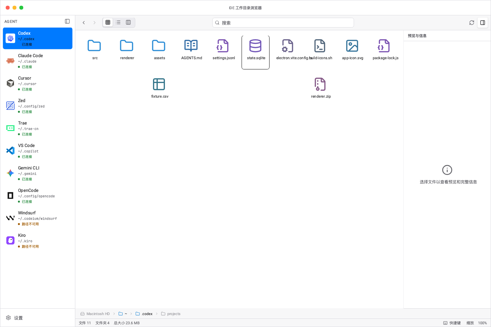
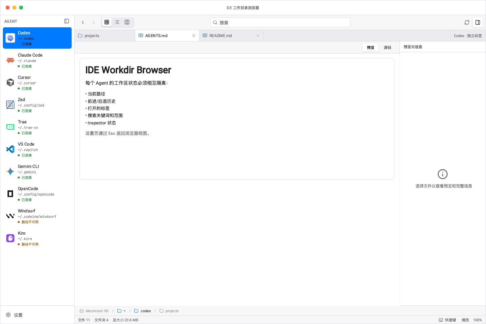

<p align="center">
  
</p>

<h1 align="center">IDE Workdir Browser</h1>

<p align="center">
  面向 AI 编程 Agent 的 macOS 工作目录浏览器，在一个窗口中完成目录浏览、搜索、预览和安全的文件操作。
</p>

<p align="center">
  <strong>macOS 13+</strong> · <strong>Apple Silicon / Intel</strong> · <strong>Electron + React + TypeScript</strong>
</p>

IDE Workdir Browser 将 Codex、Claude Code、Cursor、Zed、Trae、VS Code、Gemini CLI、
OpenCode、Windsurf 和 Kiro 的工作目录集中到一个 Finder 风格界面中。每个 Agent 独立保存路径、
导航历史、标签、搜索上下文、选择和 Inspector 状态，切换时不会混用工作区。

项目处于 `0.1.0` 开发阶段，仅支持 macOS。

## 界面预览

以下界面由当前 OpenPencil 高保真设计稿导出，使用产品默认的 `~` 路径和虚构文件名模拟真实使用
场景，不采集任何用户设备或工作目录数据。

### 工作目录总览

图标、列表和 Finder 风格分栏视图共享同一套文件类型语义，并支持 Agent 独立工作区。



### Markdown 与 Mermaid 预览

Markdown 支持 GFM、Mermaid、预览/源码切换、文档标签和 Inspector 元数据。



### 外观与文件夹图标

支持浅色、深色、自动主题、强调色、界面缩放、字体大小及三套文件夹图标预设。


截图不包含真实用户文件、账号、设备名或本机绝对路径。导出说明见
[截图说明](ide-workdir-browser-code/docs/screenshots/README.md)。

## 核心能力

### 浏览与搜索

- 图标、列表和 Finder 风格分栏视图。
- 独立的前进/后退历史、路径栏和多文档标签。
- 当前目录递归文件名搜索，带超时、结果上限和符号链接循环保护。
- SQLite、JSON/JSONL、Markdown、配置、脚本、密钥、表格、归档、图片等语义图标。

### 预览与信息

- 文本、代码、JSON/JSONC、Markdown、Mermaid 和图片预览。
- 二进制、超限及不支持文件提供明确状态和默认应用打开入口。
- Inspector 展示轻量预览、完整路径、类型、大小和时间信息。
- Markdown 外链和生成内容经过安全限制，不执行用户文件。

### 文件操作

- Finder 拖入复制及 Agent 间复制、剪切、粘贴。
- 执行前预检影响范围、冲突和错误。
- 保留两者、跳过和替换三种冲突策略。
- 进程内撤销，以及带二次确认和路径边界保护的 macOS 废纸篓操作。

### 设置与系统集成

- 每个 Agent 可独立配置路径、启用状态和默认项。
- 设置通过 `electron-store` 持久化并串行保存。
- 原生 macOS 菜单、Finder 定位、系统剪贴板和集中式快捷键。
- 关于页可手动检查最新稳定版 GitHub Release。

## 支持的 Agent

| Agent      | 默认工作目录          | Agent       | 默认工作目录         |
| ---------- | --------------------- | ----------- | -------------------- |
| Codex      | `~/.codex`            | Claude Code | `~/.claude`          |
| Cursor     | `~/.cursor`           | Zed         | `~/.config/zed`      |
| Trae       | `~/.trae-cn`          | VS Code     | `~/.copilot`         |
| Gemini CLI | `~/.gemini`           | OpenCode    | `~/.config/opencode` |
| Windsurf   | `~/.codeium/windsurf` | Kiro        | `~/.kiro`            |

目录不存在时会显示“路径不可用”；访问受 macOS 保护的目录时，授权只影响对应 Agent，不需要申请
完全磁盘访问权限。

## 下载与安装

发布包由 GitHub Actions 生成，可在仓库的 [Releases](../../releases) 区域下载：

| 设备          | 安装包                                    |
| ------------- | ----------------------------------------- |
| Apple Silicon | `IDE Workdir Browser-<version>-arm64.dmg` |
| Intel Mac     | `IDE Workdir Browser-<version>-x64.dmg`   |
| 完整性校验    | `SHA256SUMS`                              |

下载匹配架构的 DMG 和 `SHA256SUMS` 后，在同一目录执行：

```bash
shasum -a 256 -c SHA256SUMS
```

打开 DMG，将应用拖入“应用程序”目录。

> [!WARNING]
> 当前 DMG 未配置 Developer ID Application 签名和 notarization。正式分发和自动安装更新前仍需
> 完成签名与公证；请在运行前核对 SHA-256 校验和。

## 版本与发布格式

项目遵循 [Semantic Versioning](https://semver.org/)：

| 类型       | 格式          | 使用场景                   |
| ---------- | ------------- | -------------------------- |
| Patch      | `v1.2.3`      | 缺陷修复、文档或兼容性维护 |
| Minor      | `v1.3.0`      | 向后兼容的新能力           |
| Major      | `v2.0.0`      | 包含不兼容变更             |
| Prerelease | `v1.3.0-rc.0` | 发布候选或验证版本         |

Git Tag 和 GitHub Release 标题统一为 `v<version>`。Release 资产固定包含两个 DMG 和
`SHA256SUMS`。

正式 Release Notes 使用以下结构：

```markdown
# IDE Workdir Browser v<version>

> 未签名、未公证提示

## Downloads

| Architecture | Asset |
| Apple Silicon | IDE Workdir Browser-<version>-arm64.dmg |
| Intel | IDE Workdir Browser-<version>-x64.dmg |

## Installation

下载、校验并拖入“应用程序”目录。

## Verify integrity

shasum -a 256 -c SHA256SUMS

## What's Changed

由 GitHub 根据提交和 Pull Request 自动生成。
```

发布工作流位于 `.github/workflows/release.yml`：

- 手动选择 `patch`、`minor`、`major` 或 `prerelease`。
- 默认 `dry_run=true`，只验证版本、质量门禁、双架构 DMG 和 Artifact。
- 正式发布使用 GitHub Actions Bot 创建版本提交、原子 Tag 和 GitHub Release。
- 已存在的 Tag 或 Release 不会被静默覆盖；可使用显式版本恢复未完成的发布。

## 本地开发

要求：

- macOS 13 Ventura 或更高版本。
- Node.js 22 或更高版本。
- npm 11 或兼容版本。

所有应用命令均在源码目录执行：

```bash
cd ide-workdir-browser-code
npm install
npm run dev
```

生产构建：

```bash
npm run build
npm run build:unpack
npm run build:mac
```

更多开发命令和目录说明见 [源码 README](ide-workdir-browser-code/README.md)。

## 质量门禁

```bash
cd ide-workdir-browser-code
npm run format
npm run check
npm run precommit
```

`npm run check` 包含：

- 仓库隐私扫描和版本一致性检查。
- Prettier、ESLint 和 Node/Web TypeScript 类型检查。
- Vitest 全量测试和覆盖率门禁。
- 语句/行覆盖率不低于 `90%`，分支/函数覆盖率不低于 `80%`。

GitHub CI 会在 Pull Request 和 `main` 推送时重复执行完整检查与生产 Bundle 构建。真实桌面回归
按正向、边缘和负向用例归档在
[Computer Use 回归记录](ide-workdir-browser-code/docs/computer-use-regression.md)。

## 架构与安全

```text
Renderer (React)
    │  window.workdir
    ▼
Preload (contextBridge)
    │  typed IPC
    ▼
Main Process
    ├── WindowService / MenuService
    ├── SettingsService / UpdateService
    ├── FileSystemService
    └── PathPolicy
```

- `contextIsolation: true`、`sandbox: true`、`nodeIntegration: false`。
- Renderer 不直接访问 Node.js、Electron、文件系统或网络更新源。
- 文件读取、搜索、预览、Finder 和外部打开均由 Main Process 执行。
- Renderer 提供的路径不可信，主进程按 Agent 工作目录入口校验。
- 工作目录中的符号链接入口可访问目标；搜索默认不递归符号链接目录。
- 应用不执行、解释或动态导入用户文件，也不上传工作目录内容。

## 当前限制

- 仅支持 macOS 13+。
- 当前文件浏览和应用内传输以单选为主。
- 目录超限时会截断，尚未提供继续加载。
- 当前 Agent / 全部 Agent 搜索范围尚未开放。
- 自定义 Agent 新增和移除尚未开放。
- 浏览状态、标签和文件操作撤销不跨应用重启。
- 当前发布包未签名、未公证，不支持自动下载安装更新。

产品状态和验收标准以 [PRD](ide-workdir-browser-code/docs/PRD.md) 为准；设计取舍见
[设计决策](ide-workdir-browser-code/docs/design-decisions.md)。

## 贡献

修改代码前请阅读 [AGENTS.md](AGENTS.md)。行为变更必须补充测试，并同步检查 PRD、设计决策、
Computer Use 回归、两个 README 和设计资产。

## 许可证

本项目基于 [MIT License](LICENSE) 开源。
