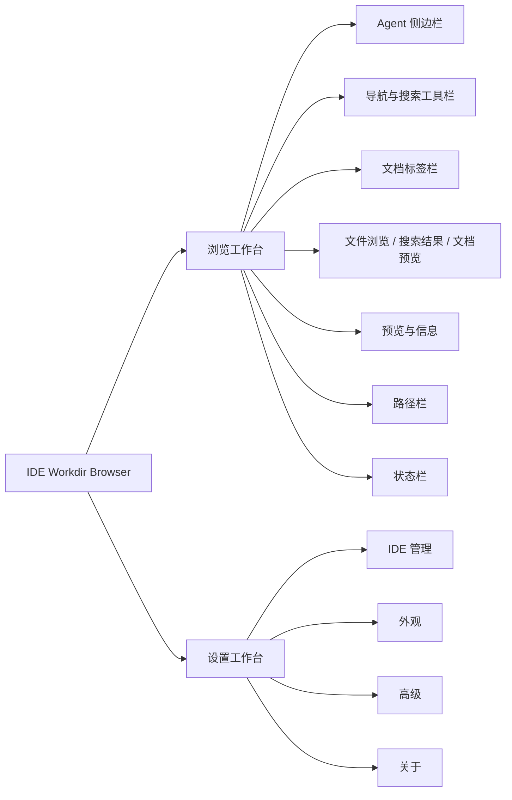

# IDE Workdir Browser 产品需求文档

| 项目         | 内容         |
| ------------ | ------------ |
| 文档版本     | 2.4          |
| 对应应用版本 | 0.1.1        |
| 产品基线日期 | 2026-08-07   |
| 支持平台     | macOS 13+    |
| 文档状态     | 当前产品基线 |

## 1. 文档定位

本文档描述 IDE Workdir Browser 当前已经实现的产品能力、行为边界和验收标准，是后续产品设计、
研发实现和测试验收的产品真源。

本文档使用以下状态口径：

- **已实现**：用户可以通过当前界面或系统菜单完成完整流程。
- **受限**：能力已经可用，但存在本文明确列出的范围或生命周期限制。
- **未开放**：代码可能存在底层契约或预留字段，但当前用户界面不能完成该流程。
- **不在范围**：当前产品明确不提供，不应通过局部实现绕过产品约束。

本版本以当前源码、类型契约、自动化测试和打包配置重建，不继承旧原型中的功能声明、DOM 映射
或历史里程碑口径。新需求应先更新本文档，再同步设计决策、回归用例和实现。

## 2. 产品概述

### 2.1 产品定义

IDE Workdir Browser 是一款仅面向 macOS 的本地桌面应用，用于在一个窗口中统一浏览和管理多个
AI 编程 Agent 的工作目录。

应用提供 Finder 风格的目录浏览、文件搜索、内容预览、Agent 间文件复制和移动，以及工作目录
相关设置。文件内容仅在本机处理，不依赖账号、云服务或远程索引。

### 2.2 目标用户

- 同时使用多个 AI 编程 Agent 或 Agent IDE 的开发者。
- 需要查看各 Agent 配置、会话产物和本地工作文件的用户。
- 需要在不同 Agent 工作目录之间安全迁移文件的用户。

### 2.3 核心价值

1. **统一入口**：集中展示多个 Agent 的本地工作目录和可用状态。
2. **上下文隔离**：每个 Agent 保留独立的路径、历史、标签、选择和视图状态。
3. **高效检查**：无需打开完整 IDE 即可搜索、预览和定位文件。
4. **受控互操作**：通过预检、冲突策略、确认和撤销完成跨 Agent 文件传输。
5. **本地优先**：文件系统访问和内容处理均在本机完成。

### 2.4 不在当前范围

- Windows 或 Linux 支持。
- 文本编辑、代码执行、终端或脚本运行。
- Git 操作、版本控制工作台或代码评审。
- 云同步、账号体系、远程文件系统或协作功能。
- 通用 Finder 替代品。
- 新建、重命名或永久删除。
- 插件系统和用户自定义预览执行器。

## 3. 产品范围与状态

### 3.1 当前能力总览

| 能力                                   | 状态   | 当前范围                                 |
| -------------------------------------- | ------ | ---------------------------------------- |
| 10 个默认 Agent                        | 已实现 | 固定内置并可修改路径、启用状态和默认项   |
| Agent 独立工作区                       | 已实现 | 当前应用进程内隔离和恢复                 |
| 图标、列表、分栏视图                   | 已实现 | Finder 风格浏览                          |
| 目录导航与历史                         | 已实现 | 工具栏、路径栏、鼠标侧键                 |
| 当前目录递归搜索                       | 已实现 | 按文件名子串匹配                         |
| 当前 Agent / 全部 Agent 搜索           | 未开放 | 主进程契约支持，界面无范围切换入口       |
| 文本、代码、Markdown、图片和二进制预览 | 已实现 | 受文件类型和大小限制                     |
| 文档标签                               | 已实现 | 按 Agent 隔离，不跨重启持久化            |
| Inspector                              | 已实现 | 轻量预览和完整元数据                     |
| Finder 拖入复制                        | 已实现 | 支持多来源、预检、确认和冲突处理         |
| Agent 间复制、剪切和粘贴               | 已实现 | 当前为单选项、进程内剪贴板               |
| 文件操作撤销                           | 受限   | 进程内记录，通过操作完成消息触发         |
| 设置自动保存                           | 已实现 | 显示保存中、已保存和保存失败             |
| 按目录文件访问授权                     | 已实现 | 单 Agent 隔离、系统设置引导和返回后复检  |
| 移到废纸篓                             | 受限   | 单选项、二次确认、使用 macOS 废纸篓恢复  |
| 永久删除                               | 未开放 | 不提供绕过废纸篓的删除能力               |
| 自定义 Agent 新增和移除                | 未开放 | 数据结构兼容，界面不提供管理入口         |
| 手动检查稳定版更新                     | 已实现 | 关于页按需检查 GitHub Release 并跳转下载 |
| 代码签名和 notarization                | 受限   | 当前打包配置显式关闭 notarization        |

### 3.2 默认 Agent

默认 Agent 按以下顺序展示：

| Agent       | 默认工作目录          |
| ----------- | --------------------- |
| Codex       | `~/.codex`            |
| Claude Code | `~/.claude`           |
| Cursor      | `~/.cursor`           |
| Zed         | `~/.config/zed`       |
| Trae        | `~/.trae-cn`          |
| VS Code     | `~/.copilot`          |
| Gemini CLI  | `~/.gemini`           |
| OpenCode    | `~/.config/opencode`  |
| Windsurf    | `~/.codeium/windsurf` |
| Kiro        | `~/.kiro`             |

应用启动时解析 `~`，并将每个 Agent 标记为：

- `已连接`：目录存在且可读。
- `路径不可用`：目录不存在或无法解析。
- `需授权`：目录存在，但 macOS 拒绝读取。

## 4. 信息架构

应用包含两个顶层工作台：



设置工作台是独立界面，不显示浏览器工具栏、文档标签、路径栏或状态栏。用户可通过侧边栏设置
入口或 `⌘,` 进入，通过“返回浏览器”或 `Esc` 返回。

## 5. 工作区与状态模型

### 5.1 Agent 状态隔离

每个已启用 Agent 拥有独立的：

- 当前路径。
- 前进和后退历史。
- 打开的文档标签和当前标签。
- 搜索关键词和搜索结果上下文。
- 当前选中项。
- 图标、列表或分栏视图模式。
- Inspector 显示状态。
- 分栏视图当前活动目录。

切换 Agent 时，当前应用进程内应恢复该 Agent 最近一次会话，不得显示其他 Agent 的目录、
选择、标签或搜索结果。

### 5.2 生命周期

- 工作区状态仅存在于当前应用进程，不在重启后恢复。
- 应用启动时打开设置中的默认 Agent。
- Agent 根目录被修改时，超出新根目录的旧工作区和会话必须重建。
- Agent 被禁用时，不再出现在浏览侧边栏中。
- 设置、Agent 配置和默认 Agent 通过 `electron-store` 持久化。

## 6. 浏览工作台

### 6.1 启动与空态

应用启动后必须：

1. 读取持久化设置和 Agent 状态。
2. 创建所有已启用 Agent 的独立工作区。
3. 打开默认 Agent 的根目录。
4. 访问桌面、文稿等受保护位置时，由 macOS 按目录提示用户授权。
5. 用户拒绝时只隔离对应 Agent，其他 Agent 和设置仍可使用。
6. 在读取期间显示加载状态。
7. 在目录缺失、无权限或不是文件夹时显示可操作的中文说明，不暴露 Electron 或 Node.js
   原始错误。

空目录应明确提示可以从 Finder 拖入文件或文件夹。

### 6.2 侧边栏

- 仅展示已启用 Agent。
- 每项展示品牌图标、名称、配置路径和文字状态。
- 当前 Agent 使用主强调色选中。
- 标准宽度为 `220px`，折叠宽度为 `48px`。
- 折叠后保留 Agent 图标、侧边栏开关和设置入口。
- 窗口初始宽度不超过 `720px` 时默认折叠；用户仍可手动展开。

### 6.3 工具栏

工具栏提供：

- 后退和前进。
- 图标、列表、分栏视图切换。
- 搜索输入和清除。
- 刷新当前目录。
- 显示或隐藏 Inspector。

不可执行的后退或前进按钮必须禁用。切换视图不改变当前目录，但应清除分栏视图的活动路径。

### 6.4 目录读取规则

- 默认隐藏名称以 `.` 开头的项目。
- 开启“显示隐藏文件”后展示隐藏项目，并使用半透明样式区分。
- 目录和目录符号链接排在文件前，其余按中文区域规则和数字顺序排序。
- 当前目录项目数超过目录阈值时只返回前 N 项，并在状态栏显示“目录已分页”。
- 当前版本没有继续加载下一页的入口，因此该行为实质为截断，详见“已知限制”。
- 目录读取不会自动监听磁盘变化，用户通过刷新重新读取。

### 6.5 选择与打开

图标和列表视图：

- 单击项目表示选择，并在短延迟后刷新 Inspector。
- 双击目录进入该目录。
- 双击文件在主工作区文档标签中打开。
- 双击必须取消尚未执行的单击预览，避免重复读取。

分栏视图：

- 单击目录在右侧增加一列并读取子目录。
- 选择上层项目时裁剪已经失效的后续列。
- 新列出现后自动滚动到最右侧。
- 单击文件选中，双击或按 `Enter` 打开文件。
- 目录项目支持 `ArrowRight` 展开。

### 6.6 三种视图

**图标视图**

- 自适应网格排列。
- 图片在可用时显示缓存缩略图。
- 文件名最多显示两行，长连续字符和下划线可断行，完整名称通过 tooltip 提供。

**列表视图**

- 展示名称、大小、种类和修改时间。
- 文件名单行省略，完整名称通过 tooltip 提供。
- 目录大小显示为 `—`。

**分栏视图**

- 模仿 macOS Finder 的层级列。
- 每列独立纵向滚动，整体横向滚动。
- 路径栏跟随当前活动列，而非始终只显示根列表路径。

### 6.7 导航历史与路径栏

- 进入目录会追加历史，并丢弃当前历史位置之后的前进记录。
- 工具栏后退和前进只能在历史边界内移动。
- 鼠标侧键 3 和 4 在浏览工作台映射为后退和前进。
- 底部路径栏显示从 `Macintosh HD` 到当前路径的分段。
- 只有位于当前 Agent 配置入口之内的路径段可点击。
- 当前段、入口之外的祖先段和动画退出段不可点击。

### 6.8 状态栏

状态栏展示当前已加载目录的：

- 文件数量。
- 文件夹及目录符号链接数量。
- 当前层文件总大小，不递归统计子目录。
- 目录截断状态。
- 全局处理中状态。
- 快捷键速查。
- `75%`、`100%`、`125%`、`150%` 缩放选择。

## 7. 搜索

### 7.1 当前用户能力

- 用户在工具栏输入关键词并提交搜索。
- 当前界面固定从当前目录开始递归搜索。
- 搜索按文件名进行不区分大小写的子串匹配，不搜索文件内容。
- 搜索结果在主内容区显示，不使用弹出层。
- 结果展示文件名、完整路径、种类、大小和修改时间。
- 双击结果打开文件；目录结果进入目录。
- 清空搜索输入后返回目录浏览。

### 7.2 搜索边界

- 是否包含隐藏文件跟随全局“显示隐藏文件”设置。
- 默认不递归目录符号链接。
- 开启“跟随符号链接”后可递归目录符号链接，并通过真实路径去重防止循环。
- 搜索受最大结果数和搜索超时限制。
- 达到结果上限、超时或仍有未扫描目录时标记为截断，并提示缩小范围。
- 无法读取的子目录被跳过，不中断整个搜索。

### 7.3 未开放搜索范围

共享契约支持“当前目录”“当前 Agent”“全部 Agent”三种范围，但当前工作区始终初始化为“当前
目录”，界面没有切换入口。产品验收只能将“当前目录”视为已交付能力。

## 8. 文件预览

### 8.1 预览承载

- 单击文件后，Inspector 展示轻量预览和元数据。
- 双击文件后，在主工作区创建文档标签并展示完整预览。
- 同一路径在同一 Agent 中只打开一个标签。
- 文档标签按 Agent 隔离。
- 标签栏始终提供一个返回当前文件夹的浏览标签。
- 关闭当前文档后激活右侧标签；没有右侧标签时激活左侧标签；没有文档时返回浏览标签。

### 8.2 支持类型与限制

| 类型        | 识别方式                                  | 应用内限制 | 展示方式                    |
| ----------- | ----------------------------------------- | ---------- | --------------------------- |
| Markdown    | `.md`、`.mdx`、`.markdown`                | `2MB`      | GFM、Mermaid 或源码         |
| 文本和代码  | 已知文本、配置和代码扩展名                | `2MB`      | UTF-8 文本和 Prism 语法高亮 |
| 图片        | AVIF、BMP、GIF、ICO、JPEG、PNG、SVG、WebP | `10MB`     | 主区原比例图片              |
| 其他文件    | 未识别扩展名                              | `512KB`    | 十六进制和 ASCII 对照       |
| `.DS_Store` | 固定文件名                                | 不预览     | macOS 元数据提示            |
| 超限文件    | 按上述类型限制                            | 不读取内容 | 提示并允许默认应用打开      |

### 8.3 文本和代码

- 支持常见 C/C++、CSS、Go、HTML、Java、JavaScript、JSX、Python、Ruby、Rust、SCSS、
  Shell、SQL、Swift、TypeScript、TSX、TOML、YAML 等语法高亮。
- JSON 和 JSONC 在展示层尝试格式化；格式化失败时保留原文。
- 非标准 UTF-8 字节使用替换字符显示，并给出编码提示。
- 代码块提供“复制全文”，显示复制成功或失败状态。

### 8.4 Markdown

- 支持 GitHub Flavored Markdown。
- 渲染预览时移除文档开头的 YAML front matter。
- Markdown 可在“预览”和“源码”之间切换。
- 相对文档链接按当前文件目录解析，并在当前 Agent 的独立标签中打开；同文档锚点在预览内定位。
- HTTPS 链接交给系统浏览器打开，其他协议不得触发 Renderer 页面导航。
- Mermaid fenced code block 使用严格安全模式渲染。
- Mermaid 输出必须移除 `script`、`foreignObject`、事件属性和 `javascript:` 属性。
- Mermaid 失败时显示原图表源码和错误，而不是隐藏内容。

### 8.5 图片和缩略图

- 主工作区图片保持比例并适配可用空间。
- Inspector 展示图片缩略预览和元数据。
- 文件视图只为图片请求缩略图。
- 缩略图优先使用 macOS 原生缩略能力，并在当前进程缓存。
- 缩略图失败时回退为文件类型图标，不阻断目录浏览。

### 8.6 Inspector

Inspector 固定宽度为 `256px`，展示：

- 文本、代码或图片的轻量预览。
- 文件名。
- 完整路径。
- 文件种类。
- 大小。
- 修改时间。
- 创建时间。
- “在 Finder 中显示”操作。

目录只展示目录图标和元数据，不递归生成内容预览。窗口初始宽度不超过 `720px` 时 Inspector
默认关闭；用户可手动打开。收起时组件保持挂载、设置不可交互语义，并且不得让主内容区出现无意义
横向滚动条。

## 9. 文件操作

### 9.1 Finder 拖入复制

- 用户可将 Finder 中一个或多个文件或文件夹拖入当前目录。
- 拖到目录项目时，该目录成为目标；否则当前目录成为目标。
- 拖入阶段显示目标目录和项目数量。
- 松开后先执行预检，不直接写入磁盘。

### 9.2 Agent 内和 Agent 间传输

- 用户可通过右键菜单或 `⌘C`、`⌘X` 将当前单选项放入应用内文件剪贴板。
- 文件剪贴板包含来源 Agent、来源路径和复制或剪切语义。
- 切换 Agent 后仍可粘贴到当前目录或指定目录。
- 复制保留来源；剪切在目标复制成功后移除来源。
- 当前版本不支持多选，因此应用内复制和剪切每次只处理一个选中项。

### 9.3 预检与确认

执行前必须展示：

- 来源数量。
- 递归项目数量。
- 总字节数。
- 目标目录摘要。
- 无效来源错误，界面最多展示前三项。
- 已存在的同名项目数量。

存在冲突时提供：

- **保留两者**：默认策略，生成 `copy`、`copy 2` 等不冲突名称。
- **跳过**：保留目标，不写入冲突项。
- **替换**：备份原目标后写入来源。

目标无效或不可写时不得进入确认流程。部分来源无效时可继续处理其余有效来源；没有有效来源时执行
按钮必须禁用。文件夹不能复制到自身或其子目录。

### 9.4 结果和撤销

- 完成后通过消息汇总复制、移动、重命名、替换、跳过和错误数量。
- 成功复制或移动后提供“撤销”动作。
- 撤销复制会删除本次创建的目标。
- 撤销移动会把目标移回来源 Agent。
- 撤销替换会恢复被替换的原文件。
- 部分撤销失败时必须显示恢复数量和错误数量。

撤销索引只存在于当前主进程，不跨应用重启持久化；替换备份写入系统临时目录，但应用重启后
无法重新关联。用户可见撤销入口依赖操作完成消息，默认显示约 10 秒。

### 9.5 移到废纸篓

- 仅支持当前单选文件、文件夹或符号链接入口。
- 入口来自右键菜单和 `⌘⌫`；点击空白区域或没有选中项时不得执行。
- 执行前必须显示二次确认，说明项目名称、完整路径、影响范围和可通过 macOS Finder 废纸篓恢复。
- 对话框默认聚焦“取消”，支持 `Esc` 取消；取消不得调用主进程废纸篓能力。
- 确认后由主进程调用 macOS `shell.trashItem`，不提供永久删除。
- 成功后显示结果消息，清理受影响选择、标签和应用内文件剪贴板，并刷新当前 Agent；若 Agent 已切换，则让该 Agent 会话失效，待下次进入时重读。
- 应用内不提供废纸篓撤销；恢复依赖 Finder 的废纸篓。
- 主进程必须拒绝 Agent 工作目录根目录本身。
- 主进程必须拒绝通过符号链接目录移到废纸篓工作目录外的真实文件或文件夹。
- 选中符号链接入口时，只移动链接入口本身，不删除链接目标。

### 9.6 右键菜单

当前右键菜单提供：

- 打开。
- 在 Finder 中显示。
- 复制。
- 剪切。
- 粘贴或粘贴到此处。
- 复制路径。
- 显示简介。
- 移到废纸篓。

点击空白区域时，与具体文件相关的动作必须禁用。
菜单必须显示在窗口级浮层中，不受文件区滚动容器或 Inspector 裁剪；靠近窗口边缘打开时应自动
回退到可视区域内。

## 10. 设置工作台

### 10.1 保存模型

- 所有设置使用自动保存。
- 并发设置修改必须串行提交，避免后返回的旧请求覆盖新值。
- 页面标题区显示“正在保存…”“已保存”或“保存失败”。
- 保存失败时保留错误状态，并通过全局消息提供用户可理解的说明。

### 10.2 IDE 管理

用户可以：

- 查看所有内置及已存在配置中的 Agent。
- 查看解析后的完整工作目录和连接状态。
- 编辑工作目录文本。
- 通过 macOS 目录选择器选择工作目录。
- 取消未保存的路径草稿。
- 启用或禁用 Agent。
- 从已启用 Agent 中选择默认 Agent。

工作目录不能为空。保存路径后重新解析 Agent 状态；路径根发生变化时重建对应工作区。

### 10.3 外观

| 设置         | 可选值                        |
| ------------ | ----------------------------- |
| 主题         | 浅色、深色、自动跟随 macOS    |
| 强调色       | 蓝、绿、橙、紫、红            |
| 界面缩放     | `75%`、`100%`、`125%`、`150%` |
| 字体大小     | 小、中、大、特大              |
| 文件夹图标   | 线框、实心、双色              |
| 显示隐藏文件 | 开、关                        |

强调色只用于品牌和交互强调；成功、警告和错误保持独立语义色。

文件图标应按类型提供稳定的图形语义，至少区分文件夹、数据库、JSON/JSONL、Markdown、图片、
代码、配置、归档、表格、终端脚本、密钥/证书、文档和二进制文件。文件夹图标预设全局应用于
图标、列表、分栏、搜索结果、Inspector 和文档标签。

### 10.4 高级

| 设置           | 默认值  | 有效范围       | 当前作用                     |
| -------------- | ------- | -------------- | ---------------------------- |
| 跟随符号链接   | 关      | 开、关         | 控制搜索是否递归目录符号链接 |
| 最大搜索结果数 | `2000`  | `100`–`10000`  | 限制单次搜索结果             |
| 文件读取超时   | `10` 秒 | `1`–`60` 秒    | 当前实际用于搜索遍历截止时间 |
| 启用分页阈值   | `5000`  | `100`–`100000` | 限制单次目录返回项目数       |

数值设置在 Renderer 和主进程共享同一约束，保存时取整并限制到有效范围。

### 10.5 还原默认设置

还原前必须通过模态对话框说明影响范围并二次确认。对话框应：

- 默认聚焦“取消”。
- 将键盘焦点限制在对话框内。
- 支持 `Esc` 取消。
- 关闭后将焦点还给触发按钮。
- 执行期间禁用操作按钮。

还原会重置 Agent、外观和高级设置，清空当前标签、浏览状态、应用内文件剪贴板和已有自定义
Agent 配置，但不会删除任何磁盘文件。

### 10.6 关于与更新检查

- 关于页显示当前应用版本和完整快捷键列表。
- 只有用户点击“检查更新”后，主进程才匿名请求公开仓库的最新稳定版 Release；应用启动时不自动
  联网。
- 检查结果必须区分：发现新版本、已是最新版本、暂无稳定版本、当前构建未配置更新源、网络错误、
  限流、超时和无效响应。
- 发现新版本时提供“查看并下载”，通过系统浏览器打开经过主进程校验的 GitHub Release HTTPS
  页面。
- 当前能力不自动下载或安装更新；未签名构建不得启用 macOS 自动更新。

## 11. 系统集成与快捷键

### 11.1 macOS 集成

- 使用隐藏内嵌标题栏和原生交通灯。
- 关闭最后一个窗口后应用保持运行；点击 Dock 图标可重新创建窗口。
- “在 Finder 中显示”调用系统 Finder。
- “使用默认应用打开”调用 macOS 默认应用。
- 应用菜单使用 macOS 原生菜单和 accelerator。
- 新窗口请求不在应用内打开；仅 `https://` 地址可交给系统浏览器。

### 11.2 快捷键

| 快捷键 | 功能                                     |
| ------ | ---------------------------------------- |
| `⌘K`   | 聚焦搜索                                 |
| `⌘1`   | 图标视图                                 |
| `⌘2`   | 列表视图                                 |
| `⌘3`   | 分栏视图                                 |
| `⌘R`   | 刷新                                     |
| `⇧⌘.`  | 显示或隐藏隐藏文件                       |
| `⌘,`   | 打开设置                                 |
| `⌘I`   | 显示或隐藏 Inspector                     |
| `⌘O`   | 打开选中项                               |
| `⌘C`   | 复制选中项；文本输入中执行原生复制       |
| `⌘X`   | 剪切选中项；文本输入中执行原生剪切       |
| `⌘V`   | 粘贴文件；文本输入中执行原生粘贴         |
| `⌘A`   | 文本输入中执行全选；浏览器暂无多选       |
| `⌥⌘O`  | 在 Finder 中显示选中项                   |
| `⌥⌘C`  | 复制选中项完整路径                       |
| `⌘⌫`   | 移到废纸篓；文本输入中不触发文件操作     |
| `Esc`  | 从设置返回浏览器；模态框中优先关闭模态框 |

## 12. 反馈、视觉与动效

### 12.1 全局反馈

- 信息、成功、警告和错误使用统一消息层。
- 消息默认显示 10 秒，支持手动关闭和可选操作按钮。
- 警告和错误使用 `alert` 语义，普通信息和成功使用 `status` 语义。
- 消息不得触发主文件内容重新渲染。
- 目录持久错误必须保留在主内容空态中，不能只依赖瞬时消息。

### 12.2 布局尺寸

| 项目           | 规格                             |
| -------------- | -------------------------------- |
| 默认窗口       | `1440 × 960`                     |
| 最小窗口       | `900 × 540`                      |
| 标题栏         | `44px`                           |
| 工具栏         | `44px`                           |
| 文档标签栏     | `34px`                           |
| 路径栏         | `30px`                           |
| 状态栏         | `24px`                           |
| 侧边栏         | 展开 `220px`，折叠 `48px`        |
| Inspector      | `256px`                          |
| 主内容最小宽度 | `256px`                          |
| 搜索框         | 标准 `360`–`560px`，最小 `160px` |

最小宽度必须同时容纳展开侧边栏、主内容最小宽度和展开 Inspector，并为工具栏导航、搜索和尾部
操作保留完整空间；不允许通过继续缩小原生窗口迫使工具栏、路径栏或状态栏重叠、换行或溢出。

### 12.3 动效

- 面板和页面级切换使用 `180ms cubic-bezier(0.2, 0, 0, 1)`。
- 菜单和即时反馈使用约 `140ms`。
- 侧边栏和 Inspector 通过尺寸、透明度和位移过渡，不瞬时卸载。
- 页面、Agent、标签、视图、设置分类和 Markdown 模式切换使用轻量淡入。
- 右键菜单、对话框、拖拽覆盖层和快捷键浮层使用轻量进入动画。
- 分栏新增列从右侧淡入并平滑滚动。
- 不对大目录中的每个文件项执行交错动画。
- 系统启用“减少动态效果”时，将相关动画和滚动降至近即时。

## 13. 可访问性

- 所有图标按钮必须提供可读 `aria-label`。
- 键盘焦点必须使用可见焦点环。
- 视图和文档标签使用 `tablist`、`tab` 和 `aria-selected`。
- 分栏列表使用 `listbox`、`option` 和 `aria-selected`。
- 右键菜单使用 `menu` 和 `menuitem`。
- 模态确认使用 `dialog` 和 `aria-modal`。
- 状态不能只依赖颜色，必须同时提供文字。
- 折叠 Inspector 使用 `aria-hidden` 和 `inert` 阻止误交互。
- 设置保存状态和代码复制状态使用 live region。
- Mermaid 图表提供图片语义和替代名称。

## 14. 安全与隐私

### 14.1 Electron 安全基线

以下配置不得弱化：

```text
contextIsolation: true
nodeIntegration: false
sandbox: true
```

Renderer 只通过类型化 `window.workdir` API 请求系统能力，不暴露原始 `ipcRenderer`。

### 14.2 文件夹访问权限

- 应用不申请完全磁盘访问权限，也不通过读取 Safari、TCC 等受保护文件探测权限状态。
- 桌面、文稿等受保护位置由 macOS 在首次实际读取时按目录提示授权。
- `EACCES` 和 `EPERM` 均归类为“需授权”，且只影响对应 Agent，不阻断应用启动或其他工作区。
- 拒绝后提供“重新尝试”“更改工作目录”和固定的“隐私与安全性 > 文件与文件夹”设置入口。
- 应用重新获得焦点时，仅对当前处于“需授权”状态的 Agent 静默复检。
- 权限恢复后 Agent 状态自动变为“已连接”；权限运行期间被撤销时按相同流程降级。
- 文件夹授权不会绕过 POSIX 权限、ACL、SIP 或应用自身的 Agent 路径边界。

### 14.3 路径授权模型

- Renderer 提供的 Agent、路径和文件操作参数均不可信。
- 主进程按“用户访问入口路径”校验路径是否位于对应 Agent 根目录。
- 校验使用路径本身的地址语义，而不是把符号链接目标真实路径强制限制在根目录。
- 因此，位于工作目录内任意层级的符号链接可以指向目录外，用户仍可通过该入口浏览、预览、
  搜索和执行已授权文件操作。
- 不能通过 `..`、绝对路径替换或其他方式直接访问工作目录之外的新入口。
- Finder 拖入来源可以位于 Agent 根目录外，但必须可读；写入目标必须通过当前 Agent 入口授权且
  可写。
- Agent 间传输的来源必须通过来源 Agent 入口授权。
- Finder 定位和默认应用打开同样经过入口路径校验。

### 14.4 内容安全

- 应用不执行、解释、动态导入或 `eval` 用户文件。
- 文本和代码预览只做解析、格式化和语法着色。
- Mermaid 使用严格模式，并对生成 SVG 进行二次清理。
- 文件内容和路径不上传到远程服务。
- 用户主动检查更新时，只请求固定公开仓库的 GitHub Release 元数据，不发送工作目录、文件内容、
  应用设置、设备标识、Token 或 Cookie。
- Release 外链必须使用 HTTPS、主机为 `github.com`，且路径属于构建时配置的同一公开仓库。
- 当前产品不包含遥测、埋点、账号或云同步。

## 15. 数据与持久化

| 数据                  | 存储位置          | 生命周期                                     |
| --------------------- | ----------------- | -------------------------------------------- |
| 应用设置和 Agent 配置 | `electron-store`  | 跨重启持久化                                 |
| Agent 浏览工作区      | Renderer 内存     | 当前应用进程                                 |
| 搜索结果和预览        | Renderer 内存     | 当前会话或切换前                             |
| 图片缩略图缓存        | Renderer 内存     | 当前应用进程                                 |
| 应用内文件剪贴板      | Renderer 内存     | 当前应用进程                                 |
| 文件操作撤销记录      | Main Process 内存 | 当前主进程                                   |
| 文件替换备份          | 系统临时目录      | 完成撤销时主动清理；否则依赖系统临时目录清理 |
| 用户文件              | 原始本地目录      | 应用不建立内容副本库                         |

## 16. 非功能要求

### 16.1 兼容性

- 运行平台固定为 macOS 13+。
- 开发和构建要求 Node.js 22+。
- 发布目标为 `arm64` 和 `x64` DMG。
- 当前没有 Windows 或 Linux 构建分支。

### 16.2 性能和资源控制

- 目录读取受项目数阈值限制。
- 搜索受时间和结果数双重限制。
- 搜索跟随符号链接时通过真实路径集合防止循环。
- 图片缩略图请求在当前进程去重并缓存。
- 异步目录刷新和预览必须忽略已经过期的响应。
- Inspector 显隐不得触发文件浏览或搜索结果重新渲染。

### 16.3 质量门禁

普通变更交付前必须通过：

```bash
npm run format
npm run check
```

`npm run check` 必须覆盖隐私扫描、版本一致性检查、Prettier、ESLint、TypeScript、Vitest 和覆盖率
门禁。版本号递增必须通过版本脚本同步更新包元数据、共享版本常量和版本相关文档。

GitHub CI 对 `main` 和 Pull Request 执行完整检查与生产 Bundle 构建。发布工作流默认 dry-run，
必须先通过版本同步、质量门禁、双架构 DMG 和校验和验证，正式模式才允许原子推送版本提交与 Tag
并创建 GitHub Release。

涉及 Electron 运行时、IPC、菜单、窗口或构建的变更还必须通过生产构建和应用冒烟验证。涉及打包
配置时必须额外执行 unpack 或 macOS 打包验证。

### 16.4 Computer Use 回归

桌面端真实用户回归的用例、执行要求、已知缺陷和历史结果统一归档在
[computer-use-regression.md](computer-use-regression.md)。

- 用例必须同时覆盖正向、边缘和负向场景。
- Electron 运行时、窗口、原生快捷键、响应式布局、设置持久化或主要用户流程变更时，必须更新
  对应用例并执行受影响范围。
- 每次执行应追加日期、构建来源、Bundle ID、窗口尺寸、通过项、失败项、阻塞项和清理结果。
- 失败用例必须保留，并关联已知缺陷；不得通过改写预期或删除用例掩盖回归。
- Computer Use 测试与 Vitest 相互补充，不能用桌面冒烟替代自动化测试或覆盖率门禁。

## 17. 已知限制与产品债务

以下内容是当前真实限制，不得在对外说明中表述为已完成：

1. **目录不具备真正分页**：超过阈值后只返回前 N 项，没有下一页或继续加载入口。
2. **搜索范围切换未开放**：当前只能搜索当前目录；“当前 Agent”和“全部 Agent”只有底层契约。
3. **高级设置命名不准确**：“文件读取超时”当前只控制搜索遍历截止时间。
4. **文件选择仅支持单选**：`⌘A` 不会在文件浏览器中选择全部项目。
5. **撤销不持久化**：关闭应用或主进程退出后不能撤销，用户可见入口默认只保留约 10 秒。
6. **临时备份清理不完整**：未执行撤销时，替换操作备份不会由应用主动按时清理。
7. **浏览状态不持久化**：重启后标签、历史、选择、搜索和 Inspector 状态重置。
8. **废纸篓恢复不在应用内**：移到废纸篓依赖 macOS Finder 恢复，应用不提供撤销或永久删除。
9. **自定义 Agent 管理未开放**：可以兼容已有数据，但不能从当前界面新增或删除。
10. **全部禁用缺少前置阻止**：设置界面尚未明确阻止用户禁用所有 Agent。
11. **无文件系统监听**：外部变化依赖手动刷新。
12. **打包未签名且未 notarize**：自动发布当前生成未签名的双架构 DMG，只支持用户查看 Release
    后手动下载；正式分发和自动安装前需要补齐 Developer ID 签名与公证流程。
13. **分栏列链恢复缺陷**：Agent 切换后视图模式和选择仍在，但已展开的右侧列和活动路径可能
    回到 Agent 根目录，见 `BUG-CU-001`。
14. **搜索结果选择缺陷**：单击搜索结果不会更新 Inspector，可能继续显示搜索前项目；双击打开
    仍可用，见 `BUG-CU-002`。

## 18. 当前版本验收标准

### 18.1 Agent 与导航

- 10 个默认 Agent 的名称、顺序和默认路径与本文一致。
- 只显示已启用 Agent，并提供连接、不可用或需授权的文字状态。
- 切换 Agent 后恢复其当前进程内的路径、标签、选择、搜索和 Inspector 状态。
- 后退、前进、路径栏和鼠标侧键不能越过历史或 Agent 入口边界。

### 18.2 浏览与预览

- 图标、列表和分栏视图均可浏览真实目录和目录符号链接。
- 隐藏文件设置、目录优先排序和目录截断提示符合本文。
- 单击不会干扰双击打开；分栏选择目录会生成正确的右侧列。
- 所有支持类型按限制正确预览，超限和不支持文件提供外部打开路径。
- Markdown GFM、Mermaid 安全渲染、JSON/JSONC 格式化和代码复制可用。

### 18.3 搜索

- 工具栏搜索从当前目录递归执行文件名匹配。
- 最大结果数、超时、隐藏文件和符号链接设置生效。
- 符号链接循环不会造成无限搜索。
- 截断和空结果均有明确状态。

### 18.4 文件操作

- Finder 拖入和 Agent 间复制或剪切均先预检、再确认、后执行。
- 保留两者、跳过和替换三种冲突策略结果正确。
- 操作结果消息准确，复制、移动和替换可在当前进程内撤销。
- 所有写入目标经过当前 Agent 入口校验。
- 移到废纸篓必须二次确认、支持取消、拒绝 Agent 根目录和符号链接目录外部目标。

### 18.5 设置与质量

- 文件夹访问被拒绝时仅将对应 Agent 标记为“需授权”，并提供重试、改路径和系统设置入口。
- 设置修改串行自动保存并展示准确状态。
- 路径编辑可选择、取消、校验空值并处理保存失败。
- 还原默认设置具有影响说明、焦点陷阱、二次确认和磁盘文件不删除保证。
- 浅色、深色、自动主题、强调色、缩放、字体、文件夹图标预设和减少动态效果正确应用。
- 关于页只在用户触发后检查最新稳定版，并正确展示新版、当前版本、无 Release、未配置和错误状态；
  新版链接只能打开同仓库 GitHub Release。
- `npm run check` 全量通过。
- 受影响的 Computer Use 正向、边缘和负向用例已执行并追加到回归归档。

## 19. 后续候选方向

以下方向尚未承诺版本，不属于当前验收范围：

- 实现真正的目录分页或无限加载，并修正现有状态文案。
- 开放当前 Agent 和全部 Agent 搜索范围。
- 支持文件多选和批量传输。
- 设计持久、可审计的文件操作历史与撤销生命周期。
- 提供应用内废纸篓恢复、批量废纸篓和更完整的文件操作历史。
- 设计新建、重命名和永久删除流程。
- 提供自定义 Agent 的新增、编辑、排序和移除。
- 选择性持久化浏览会话。
- 增加文件系统变化监听和增量刷新。
- 完成 Developer ID 签名、notarization、自动下载和安全安装更新流程。

候选方向进入开发前必须补充具体用户场景、交互设计、数据迁移、安全影响和测试验收，不得仅凭
底层类型或禁用入口判定为已实现。
